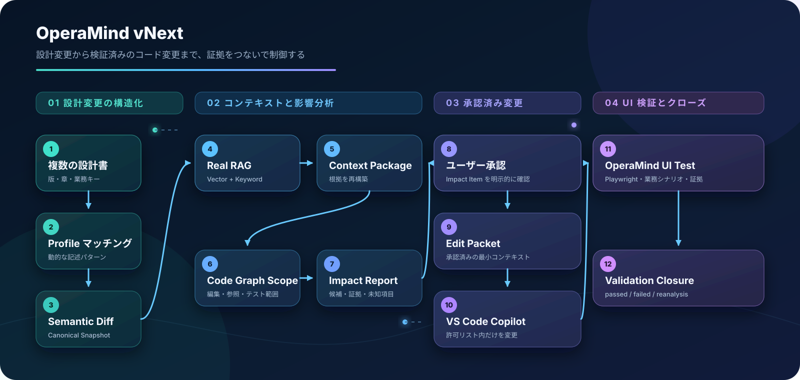

# OperaMind vNext

OperaMind は、ローカルの変更要件を起点に、設計書、コード、テスト、UI 検証を一つの流れで完了させる変更デリバリー支援ツールです。

AI による編集は **VS Code 上の GitHub Copilot** に統一します。OperaMind 自身はコードや設計書を生成せず、RAG、Code Graph、実行範囲、テストデータ、Playwright、Evidence を管理します。



## 主フロー

1. Web で変更要件を登録する。
2. RAG が関連片を検索し、`document_id` から完全な Canonical 文書と実ファイル参照を復元して、VS Code GitHub Copilot が対象設計書を修正する。
3. VS Code GitHub Copilot が設計書差分からコード候補を調査し、OperaMind が現在の Code Graph、Repository、Revision、Test Binding に照合して変更可能範囲を確定する。
4. VS Code GitHub Copilot が限定範囲のコードを変更し、差分検証後に TestPlan / TestDataPlan を生成して、設定された必須コマンドをすべて実行する。生成済みテストケースは Web から自然言語で修正を提案でき、差分と選択肢を一度確認した後だけ下流計画を再生成する。
5. OperaMind が TestDataPlan の順序で一連の業務データを生成し、その後に UI 操作・断言・スクリーンショット取得を実行する。
6. 要件、設計書差分、コード範囲、テスト結果、UI Evidence を結合した最終レポートを出力する。

Web が表示するのはこの六工程だけです。内部の承認記録、実行キュー、Lease、Worker、再試行制御は自動処理され、通常画面には表示しません。
画面は六工程を読み取るだけで、画面の表示や更新を処理継続の条件にしません。Copilot の成果物を受信した後は、内部 Coordinator が TestDataPlan、UI 検証、最終レポートまで自動で進めます。

## 役割

| コンポーネント | 責務 |
|---|---|
| OperaMind Web | 変更要件と六工程の成果物・状態を表示し、生成済みテストケースの自然言語修正を提案・確認 |
| VS Code GitHub Copilot | 設計書変更、コード変更、テスト計画生成 |
| Local Bridge / MCP | Copilot に限定コンテキストと安全な実行ツールを提供 |
| RAG / Code Graph | 設計書検索、Canonical Data 復元、コード影響範囲確定 |
| Test Data / Playwright | 画面横断データ生成、UI 操作、スクリーンショット取得 |
| Evidence / Closure | 結果検証、カバレッジ、最終レポート |

Copilot に公開する MCP は、Change Task の取得、成果物記録、コマンド実行、差分検証、最終結果記録の五つだけです。Impact、Approval、実行キューなどの内部機構を個別 Tool として公開しません。

## ローカル起動

Python 3.12 と PostgreSQL 18 + pgvector を使用します。

```bash
python3.12 -m venv .venv
.venv/bin/pip install -e '.[dev]'

export OPERAMIND_DATABASE_URL='postgresql:///operamind?host=/private/tmp&port=5432'
.venv/bin/operamind-migrate
.venv/bin/operamind-web --root . --host 127.0.0.1 --port 8765
```

Web は単機利用を前提とし、`127.0.0.1` のみで公開します。ユーザー認証はありません。VS Code Local Bridge を有効にする場合だけ、別途 `OPERAMIND_BRIDGE_TOKEN` を設定します。

TestDataPlan で対象システムの HTTP／UI Step を実行する場合は、資格情報を含まない Origin を明示します。未設定の場合、外部 HTTP／UI 実行は fail closed になります。

```bash
export OPERAMIND_TEST_TARGET_BASE_URL='http://127.0.0.1:8080'
```

## VS Code

```bash
cd vscode-extension
npm ci
npm run package:vsix
```

生成した `dist/operamind-copilot-bridge.vsix` を VS Code にインストールし、対象の隔離 worktree で Bridge Token を SecretStorage に登録します。詳細は [VS Code GitHub Copilot ワークフロー](docs/VSCODE-COPILOT-WORKFLOW.md) を参照してください。

## 品質確認

```bash
.venv/bin/python -m ruff check .
.venv/bin/python -m mypy
.venv/bin/python -m pytest -q
```

PostgreSQL 統合テストでは、管理用接続だけを `OPERAMIND_TEST_DATABASE_URL` に設定します。pytest がランダム名の一時 DB を作成・migration・削除し、通常の開発 DB を再利用しません。

## 設計文書

- [再構成方針](docs/RECONSTRUCTION.md)
- [全体アーキテクチャ](docs/ARCHITECTURE.md)
- [MVP スコープ](docs/MVP-SCOPE.md)
- [Canonical Data Model](docs/CANONICAL-DATA-MODEL.md)
- [実 RAG](docs/P2-REAL-RAG.md)
- [Code Graph](docs/P3-CODE-GRAPH.md)
- [Impact Analysis](docs/P4-IMPACT.md)
- [UI Verification](docs/P5-UI-VERIFICATION.md)
- [汎用手動 E2E テスト手順](docs/MANUAL-E2E-TEST.md)
- [品質ベースライン](docs/QUALITY-BASELINE.md)
- [Windows / WSL セットアップ](docs/WSL-PODMAN-SETUP.md)
- [机器切换后续交接](docs/MACHINE-SWITCH-HANDOFF.md)
