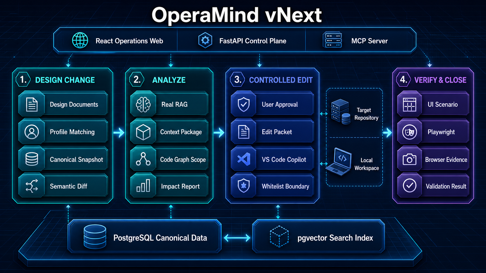

# OperaMind vNext

OperaMind vNext は、設計書の変更を起点としてコードへの影響範囲を特定し、VS Code GitHub Copilot によるコード変更を制御したうえで、OperaMind が対象システムの UI 検証を実行するための設計ベースラインプロジェクトです。

現在のリポジトリには、アーキテクチャ、25 個のコアデータ契約、Profile のサンプル、凍結済み Golden Dataset、および P0-P6 の実行可能な変更クローズドループが含まれています。文書 Diff／実 RAG、Code Graph、Impact／Approval、VS Code GitHub Copilot handoff、テストデータ、Playwright UI 検証、Change Closure までを実装しています。旧 OperaMind の Java、Python、React、生成スクリプトは継承していません。

## メインフロー


## 全体アーキテクチャ



## 不変の原則

- PostgreSQL は、ドキュメント、バージョン、ノード、リレーション、コードグラフ、影響分析結果、検証結果などの Canonical Data を保存します。
- pgvector は再構築可能な Search Index であり、Canonical `document_node_id` とスコアのみを返します。本文は Canonical DB から再取得します。
- 正式な影響分析では、Snapshot 単位で実データによる RAG を必ず実行します。keyword-only や fixture から確認可能なレポートを生成することはできません。
- Context Package は業務分析への入力です。Copilot による変更フェーズでは、承認済みの Edit Packet とローカルコードのみを参照します。
- Copilot が変更できるのは許可リスト内のファイルだけです。範囲を超える場合は処理を停止し、再分析しなければなりません。
- OperaMind は、影響を受ける UI シナリオ、Playwright の実行、ブラウザ上のエビデンス、および最終クローズを担当します。

## リポジトリ構成

```text
docs/             アーキテクチャ、MVP、RAG、Code Graph、Copilot、UI 検証の設計
contracts/        25 個のコア Artifact JSON Schema
profiles/         Embedding、設計書の記述パターン、コードフレームワークの Profile サンプル
golden-dataset/   AI 支援候補と人手で確認されたエンドツーエンド正解データの形式
readiness/        実 Provider、人手承認、Copilot、Deployment、全回帰の証拠ゲート
vscode-extension/ local Bridge 通知、SecretStorage、一クリック Copilot Coding Plan の POC 拡張
decisions/        Greenfield の境界と旧プロジェクトから抽出した知見の記録
docs/NEXT-TASKS.md 現在の未完了事項、依存条件、完了基準
```

## 双入口の変更クローズドループ

- 新しい設計書入口：`operamind-change-draft prepare documents ...`
- 新しい自然言語入口：`operamind-change-draft prepare requirement ...`
- 文書と要求の整合確認：`operamind-change-loop hybrid ...`
- Draft の承認だけではコードを実行しません。実行には、P2-P5 で永続化された実 RAG Context、Code Graph、確認済み Impact Report、Edit Packet、期限内 Approval Grant、および VS Code GitHub Copilot が変更済みの隔離 linked worktree が必要です。

`operamind-change-draft` のファイル handoff は、文書／要求から未承認の候補 Draft を生成する入口として残します。最終コード変更はファイル中継を使わず、Web が `CopilotCodingTask` を local Bridge に発行し、VS Code 拡張のユーザー確認後に GitHub Copilot が MCP から Coding Plan を取得します。テスト概要、path-only Diff、commit 結果は MCP から自動的に Web へ戻ります。文書 Draft とコードの最終変更に Codex CLI やローカル LLM の自動実行 fallback は使用しません。一方、RAG の Embedding はローカル LM Studio の Nomic Embed Text v1.5 を継続使用します。

コード編集 checkpoint が Copilot Free 上限で停止している間は、Codex の不可実行 implementation rehearsal を添付できます。これは候補 Diff、候補テスト、矛盾検出を保存するだけで、対象 worktree を変更せず、自動適用も許可しません。Copilot が復帰した後、現在の Packet、Grant、Base Revision を再検証し、VS Code 内で自分で最終変更します。

Draft には文書 Diff、コード候補、変更案、テスト Case、テストデータ、受入基準、UI シナリオが含まれます。Copilot は自分自身を承認できません。確度が不足する項目だけを `next` で一問ずつ表示し、対話で選択した内容を `answer` に記録します。すべて確認した後、`approve` は固定 Revision で再検証した候補 Case を生成します。この候補は Canonical Data ではなく、直接実行できません。

## Web コントロールプレーン

日本語の Web 画面から、変更要件の登録、Canonical な文書差分のレビュー、影響範囲の段階確認、Approval Grant の発行、実行進捗、Evidence、Readiness を一つのフローで確認できます。書き込み操作では確認者を必須とし、人工 Web 命令はデータベース Receipt と `Idempotency-Key` によって一度だけ実行・安全に再実行できます。local Bridge と Worker Lease は Task／Claim／Result の永続化されたプロトコル ID で重複を防ぎます。

画面は「変更フロー」「テスト」「Evidence」「運用」「設定」の五つのワークスペースと Task 詳細ドロワーに分かれています。Design Token、状態表示、レスポンシブ、キーボード操作、および Edge／Playwright の画像回帰基準は [Web コンソール UI](docs/WEB-CONSOLE-UI.md) を参照してください。

「自然言語から UI 検証まで一括編成」は、同じ画面にある個別操作とは別の入口です。`POST /api/v1/change-requests/{id}/automation` で永続 Run を開始し、Canonical 状態を読みながら確定的な工程を自動で進めます。設計書ドラフト／コード変更を VS Code 上の GitHub Copilot に渡す地点、設計書差分、影響項目、Approval Grant など信頼判断が必要な地点では `waiting` になり、既存の確認操作後に自動続行します。自然言語から生成・取り込み済みの Analysis Case は、日文画面、`POST .../case-binding`、または `operamind-change-automation bind-case` から監査付きで一度だけ関連付けられます。`GET .../automation` で現在工程とイベント履歴を取得し、外部処理後は `POST .../automation/{run_id}/resume` で同じ Run を再開できます。不足する RAG、Code Graph、Golden Case、UI 証跡を推測して完了扱いにはしません。

各 Automation 工程は Agent-neutral な不変 `OrchestrationTask` としても公開されます。Task は Capability、入力／出力、依存関係、受入条件だけを宣言し、Agent、Subagent、人は共通の Claim／Lease／Result API または `operamind-orchestration-task` CLI で実行できます。現在は同一 Run で一つだけ Claim できる単一 Agent 方針です。将来の複数 Subagent 化では Scheduler 方針だけを変更し、業務フローを変更しません。成功 Result はまず `submitted` となり、Canonical 状態が前進した後だけ `completed` になります。人工確認 Task は Executor 種別ではなく既存の人工確認 Artifact を受入 Evidence として要求します。詳細は [Agent-neutral タスク編成プロトコル](docs/AGENT-NEUTRAL-ORCHESTRATION.md) を参照してください。

UI Knowledge レビュー画面では、未確認の draft ごとに業務上の画面目標、Locator 候補、実ブラウザでの一致数／可視数、信頼度、issue、要素単位のサニタイズ済みスクリーンショットを確認できます。承認・却下には確認者と判断理由が必要で、元の draft を更新せず、新しい不変 `approved`／`rejected` Snapshot Version を生成します。承認した Version だけを同一 Deployment の active UI Knowledge に切り替えられます。

未解決 Evidence 管理画面では、現在の Code Graph に残るすべての unresolved Edge を、呼び出し先、Route、テーブル、Entity、設定キーなどの理由別に表示します。発生位置、候補ターゲット、不足 Evidence、解決案、provenance と一意な解決証拠を確認でき、過去 Report は上書きされません。新しい静的 Code Graph または Runtime Route Evidence から派生する Graph の発行時に自動再計算し、一意な resolved Edge が証明された項目だけを閉じます。

変更を選択すると、テストデータ管理画面に Canonical `TestDataPlan` と最新の `TestDataExecutionResult` が表示されます。再利用可能な `BusinessDataTemplate` は主従エンティティ、共有変数、インスタンス化前提条件、生成順序、業務アサーション、および従から主へ進む逆順クリーンアップを固定します。画面では Template Version、前提条件結果、生成／削除順序、各 generation flow の Fixture／API／SQL／画面ステップ、出力変数名、事後条件、最終業務アサーション、クリーンアップ結果、サニタイズ済みスクリーンショット Evidence を確認できます。パラメーター値と実行時変数値は秘密情報の混入を避けるため保存・表示せず、名前だけを表示します。画像本体は Change Request と Case に結び付いた Evidence ID から解決し、リポジトリ外のパスを拒否します。

期限内の Approval Grant が `run_test` と `record_evidence` を許可している場合、同じ画面から TestDataPlan を開始できます。Run は応答前に Canonical DB へ予約され、バックグラウンド Worker が別接続で実行します。セットアップとクリーンアップの各開始・終了イベントを追加式 Ledger に保存し、画面は実行中だけ 1 秒間隔で更新します。クリーンアップは変数値を永続化せず、同じ Run の実行コンテキスト内で必ず試行します。停止した Run は理由と固定時刻境界を伴う明示操作で `interrupted` として復旧し、再実行では旧 Run を変更せず新しい Run を作成します。各 Run の完了または復旧後には `ChangeClosureResult` を自動再評価します。

変更クローズ管理画面は `BusinessCoverageReport` と最新の `ChangeClosureResult` を同時に表示し、業務ルール別のカバレッジ、テスト合格数、UI 状態、変更ファイル数、および `blocked`／`failed`／`reanalysis_required` の理由を日本語で確認できます。証跡が不足している状態を画面側で成功に読み替えることはありません。

失敗管理画面は TestData、UI、Cleanup、Coverage、Closure の失敗を一つの読取モデルに集約し、段階、Run、失敗理由を日本語で表示します。復旧はサーバーが stale と判定した実行中 Run に限り理由入力付きで許可し、再実行は有効な Approval Grant と終了済み Run がある場合だけ新しい Run として開始します。画面側は復旧可能性や成功状態を推測しません。

生成済み Test Case は、同じ日本語画面から一つの自然言語依頼でまとめて修正できます。複数 Case にまたがるステップ、テストデータ項目、期待結果、業務アサーションを一つの `TestCaseChangeProposal` に集約し、確定差分とすべての曖昧候補を適用前に表示します。一意に解釈できる場合も自動適用せず、人が全体差分を確認した後に一度だけ新しい `TestPlan`、`TestDataPlan`、`AcceptanceCriteria`、`BusinessCoverageReport` と Orchestration Version を原子的に生成します。旧 Version の Run、Evidence、Screenshot、Coverage、Closure は履歴として保持しつつ stale と表示し、新 Version の検証結果として再利用しません。

Case 改訂後は、改訂前後の `TestDataPlan`、UI Scenario、および Repository Revision／Code Scope／実行方式／データ参照から成る実行範囲を決定的に比較します。三つの範囲が同一なら完了済み Approval Grant を自動再利用し、範囲が一つでも変われば日本語画面で差分を表示して再確認を要求します。確認後は「この Case Version を新しい Run で再実行」し、新しい Evidence、`ChangeClosureResult` と改訂前後の結果差分を生成できます。取り消しも履歴削除や上書きではなく、直前 Version の内容を復元する補償的な新 Version として記録し、その Version を同じ手順で再実行します。

UI Scenario は `test_case_refs` によって TestPlan の業務テスト Case へ明示的に対応付けます。Scenario ID と Test Case ID が偶然一致することには依存せず、対応の欠落や重複がある場合は Change Closure を阻止します。同一 Revision、同一 Edit Packet、同一 Scenario 範囲の証拠再検証では、完了済み Grant を再利用できます。ファイル、コマンド、Scenario、Revision、Deployment のいずれかが変わる場合は再承認が必要です。

```bash
export OPERAMIND_DATABASE_URL='postgresql:///operamind?host=/private/tmp&port=5432'
export OPERAMIND_BRIDGE_TOKEN='<random-local-secret>'
export OPERAMIND_WEB_TOKEN='<random-local-web-secret>'
# 既定値は 1。将来の複数 Subagent 実行時だけ変更する。
export OPERAMIND_MAX_ACTIVE_TASKS_PER_RUN='1'
operamind-web --root . --host 127.0.0.1 --port 8765
```

起動時に未適用 migration を実行し、`http://127.0.0.1:8765/` で画面を公開します。Web は常に loopback host に限定され、`OPERAMIND_WEB_TOKEN` の Bearer または Basic 認証が必要です。`/health` と local Bridge の専用 token 認証だけが例外です。Evidence は本文や秘密情報ではなく、Canonical DB に保存されたコマンド結果の digest と UI Evidence の参照だけを表示します。

### VS Code Copilot の無ファイル Bridge

1. Web で確認済み Edit Packet／Approval Grant と隔離 linked worktree を指定し、「VS Code GitHub Copilot へ送信」を押します。
2. `cd vscode-extension && npm ci && npm run package:vsix` で VSIX を作成し、VS Code の `Extensions: Install from VSIX...` から `dist/operamind-copilot-bridge.vsix` をインストールします。開発時は従来どおり `F5` も利用できます。
3. 対象 linked worktree で Command Palette の `OperaMind: Bridge Token を安全に登録` に同じ Token を保存し、日文通知から「確認して Copilot を開く」を選びます。
4. Copilot は `copilot_get_coding_task` から始め、`copilot_run_task_command`、`copilot_validate_task_diff`、`copilot_record_task_result` の順に使います。応答ファイルは作りません。

Task claim は 60 秒の lease で、拡張の heartbeat が更新します。切断／VS Code 再起動後は保存済み Task ID から同じ Task を再開し、失効 claim は別 consumer が `claim_recovered` として安全に引き継げます。取消は終端状態として記録し、再試行は旧 Task を変更せず、新しい Task ID と attempt number を作成します。POC は Copilot Coding Plan と `local_bridge` に固定されています。将来の本番 API Provider は `coding_task_provider_v1` と同じ `CopilotCodingTask` 契約を使いますが、現在は実装していません。Bridge Token は VS Code SecretStorage に保存し、ソース、設計書、Diff 本文、テストログ本文は Bridge で転送しません。詳細は [VS Code GitHub Copilot ワークフロー](docs/VSCODE-COPILOT-WORKFLOW.md) を参照してください。

### VisionDemo のローカル Deployment Binding

VisionDemo の実環境 E2E では、既定で空の fail-closed Binding を次の明示設定でだけ有効化します。

```bash
export OPERAMIND_TEST_DATA_BINDING_PROFILE='visiondemo-local'
export OPERAMIND_VISIONDEMO_BASE_URL='http://127.0.0.1:18082'
export OPERAMIND_VISIONDEMO_JDBC_URL='jdbc:h2:file:/tmp/visiondemo;MODE=MySQL;AUTO_SERVER=TRUE'
export OPERAMIND_VISIONDEMO_H2_JAR='/path/to/h2.jar'
export OPERAMIND_VISIONDEMO_JAVA='/path/to/java'
```

Fixture は既定データと実行時 ID を生成し、HTTP は承認済みの API 形状だけを送信し、SQL は名前付き参照クエリだけを実行し、UI は社員一覧と経費一覧の固定操作だけを Chrome で実行します。JDBC URL は `/tmp` 配下の H2 file と `AUTO_SERVER=TRUE` に限定し、任意 SQL、任意画面操作、資格情報を含む Base URL は受け付けません。跨画面 Plan は社員と経費を同じ変数系列で作成し、社員画面、経費画面、DB 関連を検証した後、成功・失敗のどちらでも経費、社員、DB 残存行を順にクリーンアップします。

```bash
# 1. before/after 設計書から Copilot handoff を準備する
operamind-change-draft prepare documents \
  --target-repository /path/to/application \
  --before-document /path/to/before.xlsx \
  --after-document /path/to/after.xlsx \
  --handoff-root /path/to/handoffs/change-001 \
  --draft-id change-001 --case-id change-001 --project-id demo \
  --repository-id demo-repository --application-root app \
  --scan-root app/src/main --scan-root app/src/test

# 自然言語の場合も同じ handoff 境界を使う
operamind-change-draft prepare requirement ... \
  --requirement "経費ステータスの初期値を「すべて」に変更する"

# 2. VS Code で handoff を開き、GitHub Copilot に
#    COPILOT-INSTRUCTIONS.md を実行させて ai-response.json を作成する

# Copilot Free の上限または model capacity で停止した場合、handoff に自動生成された
# checkpoint を保持したまま明示的に一時停止／再開できる
operamind-copilot-checkpoint pause \
  --checkpoint-root /path/to/handoffs/change-001 \
  --reason free_quota_exhausted

# 任意: Codex 予行案を対象 worktree の外側に添付する（自動適用不可）
operamind-copilot-checkpoint attach-rehearsal \
  --checkpoint-root /path/to/handoffs/change-001 \
  --proposal-file /path/to/codex-implementation-rehearsal.json

operamind-copilot-checkpoint resume \
  --checkpoint-root /path/to/handoffs/change-001

# 3. Copilot 応答を検証して未承認 Draft として取り込む
operamind-change-draft generate documents \
  --response-file /path/to/handoffs/change-001/ai-response.json \
  --draft-root /path/to/drafts/change-001 \
  --target-repository /path/to/application \
  --before-document /path/to/before.xlsx \
  --after-document /path/to/after.xlsx \
  --draft-id change-001 --case-id change-001 --project-id demo \
  --repository-id demo-repository --application-root app \
  --scan-root app/src/main --scan-root app/src/test

# 4. 対話で表示された選択を記録する
operamind-change-draft next --draft-root /path/to/drafts/change-001
operamind-change-draft answer --draft-root /path/to/drafts/change-001 \
  --question-id confirm-code-scope --option-id accept --answered-by developer

# 5. 人が最終確認し、Canonical 化する候補を生成する
operamind-change-draft approve --draft-root /path/to/drafts/change-001 \
  --case-root golden-dataset/cases/change-001 \
  --target-repository /path/to/application --reviewed-by developer
```

複数ケースを製品運用する場合は `operamind-change-cases` を使用します。このコマンドはケースディレクトリを自動検出し、JSON Schema、ケース内 ID、文書 SHA-256、Profile、固定 Git Revision と参照コードパスをまとめて検証します。

```bash
# 完成済みケースを安全な draft として複製する
operamind-change-cases init \
  --from-case golden-dataset/cases/visiondemo-employee-blank-name \
  --case-root golden-dataset/cases/my-new-case \
  --case-id my-new-case

# すべてのケースと外部参照を検証する
operamind-change-cases validate \
  --target-repository /path/to/target-repository \
  --before-root /path/to/documents/before \
  --after-root /path/to/documents/after

# 設計書入口、または承認済みの標準要求を使う自然言語入口で一括計画する
operamind-change-cases plan --entry documents ... --output /path/to/output
operamind-change-cases plan --entry requirement ... --output /path/to/output

# 旧 Batch の直接実行入口は使用しない。各候補を Canonical RAG／Impact／Grant
# に昇格し、VS Code GitHub Copilot の隔離 linked worktree 変更後に実行する。
```

計画は固定 Revision の clean worktree を読み取ります。実行時は同じ Git common-dir と Base Revision を持つ独立 linked worktree だけを受け付け、既存の開発用 worktreeを変更しません。`init` と Draft 承認の出力はいずれも候補であり、Canonical RAG／Impact／Grant を通過するまで実行できません。

## 実装の進め方

1. `docs/MVP-SCOPE.md` を読み、第一段階のスコープを確認します。
2. 1〜5 件の実ケースを人手で確認し、Golden Dataset を構築します。
3. `contracts/` 内の v1 契約を確定します。
4. `docs/IMPLEMENTATION-ROADMAP.md` に従って実行可能なコードを実装します。

P0 ベースラインの検証は次のコマンドで実行します。

```bash
operamind-baseline
operamind-baseline --manifest golden-dataset/manifest.golden.json --readiness-manifest readiness/mvp-readiness.json --require-ready
operamind-baseline --manifest golden-dataset/manifest.golden.json --readiness-manifest readiness/mvp-readiness.json --require-mvp-ready
operamind-approval --help
operamind-build-code-graph --help
operamind-runtime-routes --help
operamind-unresolved-evidence --help
operamind-change-loop --help
operamind-change-cases --help
operamind-change-draft --help
operamind-change-automation --help
operamind-orchestration-worker --help
operamind-profile-rebuild-worker --help
operamind-orchestration-generate-handler --help
operamind-build-edit-packet --help
operamind-build-impact --help
operamind-resolve-code-scope --help
operamind-build-context --help
operamind-build-index --help
operamind-recover-index --help
operamind-build-relations --help
operamind-diff --help
operamind-evaluate-rag --help
operamind-run-golden-rag --help
operamind-finalize-rag --help
operamind-ingest --help
operamind-migrate
operamind-mcp --help
operamind-review-change --help
operamind-record-edit-result --help
operamind-recover-command --help
operamind-run-approved-command --help
operamind-confirm-impact --help
operamind-close-change --help
operamind-ui --help
operamind-web --help
```

`operamind-run-golden-rag` は、凍結済み Golden Manifest の三つの Query 文を、固定 Snapshot、現在の Embedding Profile、および current/ready Search Index に対して実行します。Golden の意味参照は物理 `node-*` と混同せず、承認済み document/location から Index 内の一意な Canonical Slice に解決します。三つの Scope ID をすべて省略すると、この解決がすべて成功する current Index が一件だけの場合に限って Scope を確定します。結果は不変 `GoldenRagQualityReport` として保存され、意味参照と物理 Node の Binding、Recall@5、Recall@10、MRR、Query ごとの候補順位、欠落 ID、無関係ヒット、Project 漏えい、および失敗理由を保持します。最新の同一スコープ Report が `passed` でない場合、Impact Report の生成と新規確認は fail-closed で拒否されます。

`operamind-build-code-graph` は、同一 Repository・scan roots・Code Framework Profile の現在 Snapshot がある場合、Git Revision 差分から影響ファイルだけを再解析します。結果には基準 Snapshot、変更／影響パス、解析／再利用ファイル数が記録され、非祖先 Revision や Profile 変更時は全量走査へ安全にフォールバックします。監査や再構築で増分再利用を無効にする場合は `--full-scan` を指定します。

`operamind-runtime-routes` は、Browser Runner が保存した network request／page navigation／form submission のサニタイズ済み Observation を静的 Code Graph と照合します。静的 Route Ref、HTTP method、Endpoint template、候補の一意性がすべて証明された場合だけ `static_runtime` Edge を持つ新しい Snapshot を発行し、証明できない Observation は理由付きの unresolved のまま保存します。

`operamind-unresolved-evidence recompute --code-graph-snapshot-id ...` は、既存 Code Graph に対応する決定的な Report を作成または整合性確認します。通常は Code Graph 発行時に自動作成されるため、移行前 Snapshot の backfill や監査に使用します。`show --project-id ...` は current Report と上限付き履歴を JSON で返します。

Windows/WSL のセットアップと旧環境の Canonical Data／Evidence 移行については `docs/WSL-PODMAN-SETUP.md`、セットアップ、migration、手動確認項目、既知の制限については `docs/P0-BASELINE.md`、RAG の実装については `docs/P2-REAL-RAG.md`、Code Graph の実装境界については `docs/P3-CODE-GRAPH.md`、Impact と確認については `docs/P4-IMPACT.md`、UI 検証については `docs/P5-UI-VERIFICATION.md` を参照してください。

## ステータス

`golden_ready_partial`：P0-P6 の Canonical Data、実 RAG、Code Graph、Impact／Approval、隔離編集、コマンド監査、テストデータ、Playwright UI 検証、および fail-closed Change Closure を実装済みです。VisionDemo の固定 Revision に対して Fixture／HTTP／SQL／UI Binding、跨画面関連データ、失敗時 cleanup、三つの UI Scenario、TestPlan への明示対応、100% 業務 Coverage と `passed` の Canonical ChangeClosureResult を確認しています。

Golden Dataset、実 Embedding Provider、人手 Approval、target Deployment E2E には既存の通過 Evidence があります。健壮性修正後の source tree は旧 `full_local_regression` Evidence の digest と一致しないため、WSL + Podman + Microsoft Edge で再生成するまでこの gate は現在有効とは扱いません。さらに実際の VS Code GitHub Copilot 完了セッション receipt を要求する `github_copilot_live` も未完了です。この二つが解消するまで `mvp_ready` とは宣言しません。Golden RAG は 2026-07-23 に三つの実 VisionDemo 設計書、ローカル Nomic Q8、21/21 current Index で正式実行し、意味 Binding 後の三つの必須 Context がすべて rank 1、Recall@5／10 と MRR が 1.0 であること、および同 Scope の Impact gate 通過を確認しました。正確な未完了一覧と完了条件は [後続タスクリスト](docs/NEXT-TASKS.md) を参照してください。
